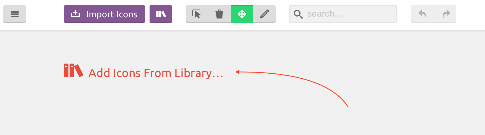
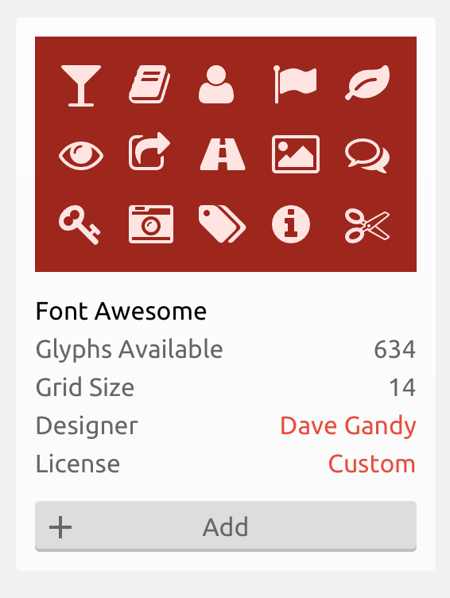
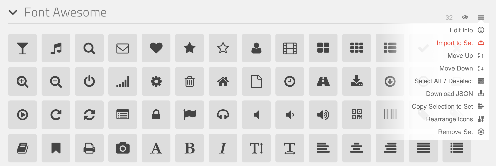
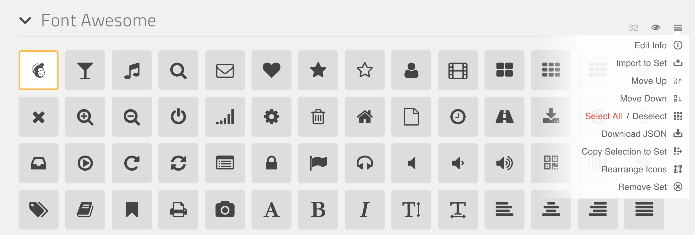
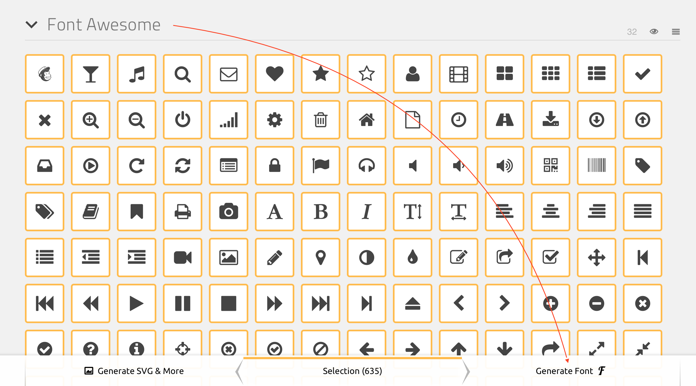

# Font-Awesome-Plus-Mailchimp

Adding a Mailchimp Icon to Font Awesome using IcoMoon

This repo will be updated from time to time as the Font Awesome project adds more icons.  You can up vote adding this icon into FA here:

<https://github.com/FortAwesome/Font-Awesome/issues/3379#issuecomment-238188409>

Otherwise you can always use IcoMoon to grab the newest FA version and re-add this one icon.  Here's How.

* Go to your [IcoMoon Projects Page](https://icomoon.io/app/#/projects)
* Create yourself a new project (or load an existing one you like)
* Choose Add Icons from library
    * []
* Add Font Awesome
    * []
* Use the hamburger menu and select Import To Set
    * []
* Import the file ```mailchimp.svg```
* Choose Select All from the same menu
    * []
* Generate The Font
    * []

Done!

[](https://www.youtube.com/watch?v=HJSn43DtnB4)

